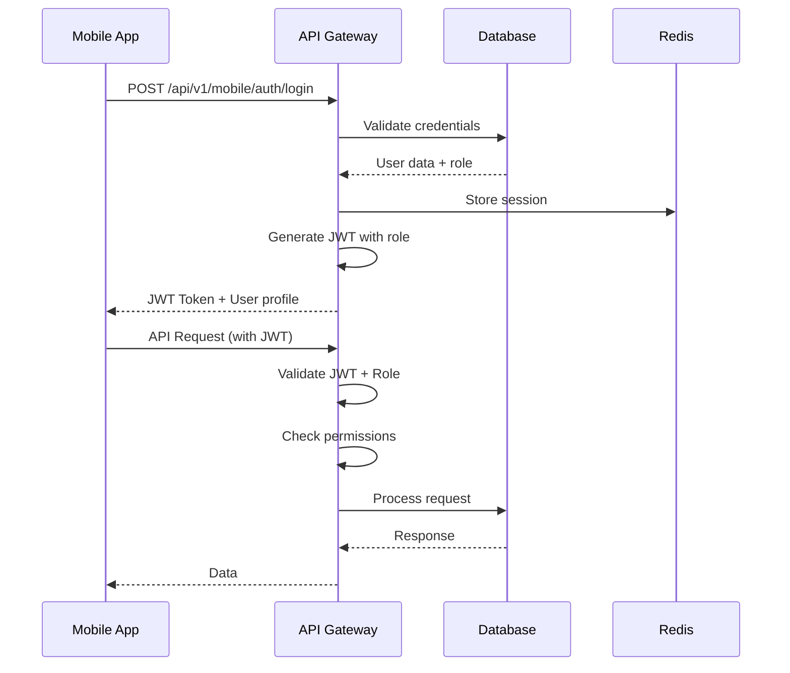

# 📱 Mobile API Architecture - نظام إدهام

## 🏗️ نظرة عامة على هيكل API الموحد

هذا المستند يصف هيكل API الموحد الذي يربط بين تطبيقات Native (Swift & Kotlin) ونظام Backend المتكامل.

---

## 🌐 الهيكلية المعمارية

```
┌─────────────────────────────────────────────────────────────┐
│                    Mobile Apps Layer                        │
├─────────────────────┬───────────────────────────────────────┤
│  iOS App (Swift)    │  Android App (Kotlin)                 │
│  • Role Detection   │  • Role Detection                      │
│  • Dynamic UI       │  • Dynamic UI                          │
│  • Native Modules   │  • Native Modules                      │
└─────────────────────┴───────────────────────────────────────┘
                              │
                              ▼
┌─────────────────────────────────────────────────────────────┐
│                    API Gateway Layer                         │
├─────────────────────────────────────────────────────────────┤
│  • Authentication (JWT)                                      │
│  • Rate Limiting                                            │
│  • Request Validation                                       │
│  • Role-Based Access Control                                │
│  • API Versioning                                          │
└─────────────────────────────────────────────────────────────┘
                              │
                              ▼
┌─────────────────────────────────────────────────────────────┐
│                    Business Logic Layer                      │
├─────────────────────────────────────────────────────────────┤
│  • User Management                                          │
│  • Order Processing                                         │
│  • Location Tracking                                        │
│  • Payment Processing                                       │
│  • Notification Management                                  │
└─────────────────────────────────────────────────────────────┘
                              │
                              ▼
┌─────────────────────────────────────────────────────────────┐
│                    Data Layer                                 │
├─────────────────────┬───────────────────────────────────────┤
│  MongoDB            │  Redis                                 │
│  • User Data        │  • Session Cache                        │
│  • Orders           │  • Location Cache                      │
│  • Transactions     │  • Real-time Data                       │
│  • Audit Logs       │  • Rate Limiting                       │
└─────────────────────┴───────────────────────────────────────┘
```

---

## 🔐 Authentication & Security

### JWT Token Structure
```json
{
  "header": {
    "alg": "HS256",
    "typ": "JWT"
  },
  "payload": {
    "userId": "64f1a2b3c4d5e6f7g8h9i0j1",
    "email": "user@example.com",
    "role": "DRIVER", // CUSTOMER, DRIVER, SUPERVISOR, ACCOUNTANT, WORKSHOP, ADMIN
    "permissions": ["location_tracking", "task_management"],
    "deviceType": "ios|android",
    "appVersion": "2.0.0",
    "iat": 1640995200,
    "exp": 1641081600
  }
}
```

### Authentication Flow


---

## 📱 Mobile API Endpoints

### 1. Authentication Endpoints

#### Login
```http
POST /api/v1/mobile/auth/login
Content-Type: application/json

{
  "email": "driver@edham.com",
  "password": "securePassword123",
  "deviceInfo": {
    "deviceType": "ios|android",
    "deviceId": "unique_device_id",
    "appVersion": "2.0.0",
    "pushToken": "firebase_push_token"
  }
}
```

**Response:**
```json
{
  "success": true,
  "data": {
    "user": {
      "id": "64f1a2b3c4d5e6f7g8h9i0j1",
      "name": "أحمد محمد",
      "email": "driver@edham.com",
      "role": "DRIVER",
      "phone": "+9665012345678",
      "avatar": "https://cdn.edham.com/avatars/driver.jpg"
    },
    "token": "eyJhbGciOiJIUzI1NiIsInR5cCI6IkpXVCJ9...",
    "permissions": ["location_tracking", "task_management", "proof_of_delivery"],
    "roleConfig": {
      "primaryColor": "#10b981",
      "navigation": [
        {"id": "dashboard", "label": "لوحة التحكم", "icon": "home"},
        {"id": "tasks", "label": "المهام", "icon": "package"},
        {"id": "location", "label": "الموقع", "icon": "navigation"}
      ]
    }
  }
}
```

#### Refresh Token
```http
POST /api/v1/mobile/auth/refresh
Authorization: Bearer <token>
```

#### Logout
```http
POST /api/v1/mobile/auth/logout
Authorization: Bearer <token>
```

### 2. Customer Endpoints

#### Create Order
```http
POST /api/v1/mobile/customer/orders
Authorization: Bearer <token>
Content-Type: application/json

{
  "route": {
    "pickup": {
      "address": "الرياض، المملكة العربية السعودية",
      "coordinates": [24.7136, 46.6753],
      "contact": {
        "name": "محمد أحمد",
        "phone": "+9665012345678"
      }
    },
    "dropoff": {
      "address": "جدة، المملكة العربية السعودية",
      "coordinates": [21.4225, 39.8262],
      "contact": {
        "name": "خالد عبدالله",
        "phone": "+966557654321"
      }
    }
  },
  "vehicle": {
    "type": "refrigerated",
    "capacity": 5000,
    "preferredSize": "large"
  },
  "cargo": {
    "type": "frozen_food",
    "weight": 3000,
    "description": "مواد غذائية مجمدة",
    "specialRequirements": ["temperature_control", "fragile"]
  },
  "scheduling": {
    "pickupTime": "2024-01-15T10:00:00Z",
    "deliveryTime": "2024-01-15T18:00:00Z",
    "flexible": true
  }
}
```

#### Get Orders
```http
GET /api/v1/mobile/customer/orders?status=PENDING&page=1&limit=10
Authorization: Bearer <token>
```

#### Track Order
```http
GET /api/v1/mobile/customer/orders/:orderId/tracking
Authorization: Bearer <token>
```

### 3. Driver Endpoints

#### Get Active Task
```http
GET /api/v1/mobile/driver/active-task
Authorization: Bearer <token>
```

#### Update Location
```http
PUT /api/v1/mobile/driver/location
Authorization: Bearer <token>
Content-Type: application/json

{
  "coordinates": [24.7136, 46.6753],
  "accuracy": 10,
  "speed": 60,
  "heading": 45,
  "timestamp": "2024-01-15T12:30:00Z"
}
```

#### Update Task Status
```http
PATCH /api/v1/mobile/driver/orders/:orderId/status
Authorization: Bearer <token>
Content-Type: application/json

{
  "status": "HEADING_TO_PICKUP",
  "notes": "في الطريق إلى نقطة الاستلام",
  "estimatedArrival": "2024-01-15T13:15:00Z"
}
```

#### Upload Proof of Delivery
```http
POST /api/v1/mobile/driver/orders/:orderId/proof
Authorization: Bearer <token>
Content-Type: multipart/form-data

{
  "files": [File, File, File],
  "notes": "تم التسليم بنجاح",
  "recipientName": "خالد عبدالله",
  "signature": "base64_signature_data",
  "photos": ["base64_photo_1", "base64_photo_2"]
}
```

### 4. Real-time Tracking

#### WebSocket Connection
```javascript
// Connect to WebSocket
const socket = io('wss://api.edham.com', {
  auth: {
    token: 'jwt_token_here'
  }
});

// Subscribe to order updates
socket.emit('subscribe_to_order', {
  orderId: '64f1a2b3c4d5e6f7g8h9i0j1'
});

// Listen for location updates
socket.on('location_update', (data) => {
  console.log('Driver location:', data);
});

// Listen for status changes
socket.on('order_status_changed', (data) => {
  console.log('Order status:', data);
});
```

### 5. Payment Endpoints

#### Create Payment Intent
```http
POST /api/v1/mobile/payments/create-intent
Authorization: Bearer <token>
Content-Type: application/json

{
  "orderId": "64f1a2b3c4d5e6f7g8h9i0j1",
  "amount": 1500.00,
  "currency": "SAR",
  "paymentMethod": "credit_card|apple_pay|google_pay"
}
```

#### Confirm Payment
```http
POST /api/v1/mobile/payments/confirm
Authorization: Bearer <token>
Content-Type: application/json

{
  "paymentIntentId": "pi_64f1a2b3c4d5e6f7g8h9i0j1",
  "paymentMethodId": "pm_64f1a2b3c4d5e6f7g8h9i0j1"
}
```

---

## 🔧 Role-Based Access Control

### Customer Permissions
```javascript
const CUSTOMER_PERMISSIONS = [
  'create_orders',
  'view_own_orders',
  'track_orders',
  'make_payments',
  'rate_drivers',
  'view_order_history'
];
```

### Driver Permissions
```javascript
const DRIVER_PERMISSIONS = [
  'view_assigned_tasks',
  'update_location',
  'update_task_status',
  'upload_proof_of_delivery',
  'view_earnings',
  'communicate_with_customer'
];
```

### Supervisor Permissions
```javascript
const SUPERVISOR_PERMISSIONS = [
  'view_all_orders',
  'assign_drivers',
  'monitor_fleet',
  'view_analytics',
  'manage_drivers',
  'dispatch_orders'
];
```

---

## 📱 Mobile-Specific Features

### 1. Push Notifications

#### Notification Types
```javascript
const NOTIFICATION_TYPES = {
  ORDER_ASSIGNED: 'order_assigned',
  ORDER_STATUS_CHANGED: 'order_status_changed',
  LOCATION_UPDATE: 'location_update',
  PAYMENT_CONFIRMED: 'payment_confirmed',
  MAINTENANCE_DUE: 'maintenance_due',
  SYSTEM_ALERT: 'system_alert'
};
```

#### Send Push Notification
```http
POST /api/v1/mobile/notifications/send
Authorization: Bearer <token>
Content-Type: application/json

{
  "userIds": ["64f1a2b3c4d5e6f7g8h9i0j1"],
  "type": "ORDER_ASSIGNED",
  "title": "طلب جديد",
  "body": "لقد تم تعيين طلب جديد لك",
  "data": {
    "orderId": "64f1a2b3c4d5e6f7g8h9i0j1",
    "priority": "high"
  }
}
```

### 2. Offline Support

#### Sync Offline Data
```http
POST /api/v1/mobile/sync/offline
Authorization: Bearer <token>
Content-Type: application/json

{
  "data": [
    {
      "type": "location_update",
      "timestamp": "2024-01-15T12:30:00Z",
      "data": {
        "coordinates": [24.7136, 46.6753]
      }
    },
    {
      "type": "task_status_update",
      "timestamp": "2024-01-15T12:35:00Z",
      "data": {
        "orderId": "64f1a2b3c4d5e6f7g8h9i0j1",
        "status": "PICKUP_CONFIRMED"
      }
    }
  ]
}
```

### 3. File Upload

#### Upload Documents
```http
POST /api/v1/mobile/upload
Authorization: Bearer <token>
Content-Type: multipart/form-data

{
  "file": File,
  "type": "driver_license|vehicle_registration|proof_of_delivery",
  "metadata": {
    "orderId": "64f1a2b3c4d5e6f7g8h9i0j1",
    "description": "إثبات التسليم"
  }
}
```

---

## 🚀 Performance Optimization

### 1. Caching Strategy
```javascript
// Redis Cache Keys
const CACHE_KEYS = {
  USER_PROFILE: `user:profile:${userId}`,
  ACTIVE_ORDERS: `orders:active:${userId}`,
  DRIVER_LOCATION: `driver:location:${driverId}`,
  FLEET_STATUS: 'fleet:status',
  RATE_LIMIT: `rate_limit:${userId}:${endpoint}`
};
```

### 2. Pagination
```http
GET /api/v1/mobile/customer/orders?page=1&limit=20&sort=createdAt:desc
```

### 3. Data Compression
```javascript
// Response compression
app.use(compression({
  level: 6,
  threshold: 1024
}));
```

---

## 🔍 Error Handling

### Standard Error Response
```json
{
  "success": false,
  "error": {
    "code": "INSUFFICIENT_PERMISSIONS",
    "message": "You do not have permission to perform this action",
    "details": {
      "requiredRole": "DRIVER",
      "userRole": "CUSTOMER",
      "endpoint": "/api/v1/mobile/driver/location"
    }
  },
  "timestamp": "2024-01-15T12:30:00Z",
  "requestId": "req_64f1a2b3c4d5e6f7g8h9i0j1"
}
```

### Error Codes
```javascript
const ERROR_CODES = {
  AUTHENTICATION_FAILED: 'AUTHENTICATION_FAILED',
  INSUFFICIENT_PERMISSIONS: 'INSUFFICIENT_PERMISSIONS',
  RESOURCE_NOT_FOUND: 'RESOURCE_NOT_FOUND',
  VALIDATION_ERROR: 'VALIDATION_ERROR',
  RATE_LIMIT_EXCEEDED: 'RATE_LIMIT_EXCEEDED',
  OFFLINE_SYNC_CONFLICT: 'OFFLINE_SYNC_CONFLICT',
  PAYMENT_FAILED: 'PAYMENT_FAILED',
  FILE_UPLOAD_FAILED: 'FILE_UPLOAD_FAILED'
};
```

---

## 📊 Monitoring & Analytics

### 1. API Metrics
```javascript
// Track API usage
const trackApiUsage = (userId, endpoint, responseTime, statusCode) => {
  analytics.track('api_usage', {
    userId,
    endpoint,
    responseTime,
    statusCode,
    timestamp: new Date()
  });
};
```

### 2. Performance Monitoring
```javascript
// Monitor response times
const performanceMiddleware = (req, res, next) => {
  const start = Date.now();
  
  res.on('finish', () => {
    const duration = Date.now() - start;
    
    if (duration > 1000) {
      logger.warn('Slow API request', {
        endpoint: req.path,
        duration,
        userId: req.user?.id
      });
    }
  });
  
  next();
};
```

---

## 🔒 Security Best Practices

### 1. Input Validation
```javascript
// Validate mobile requests
const validateMobileRequest = (schema) => {
  return (req, res, next) => {
    const { error } = schema.validate(req.body);
    
    if (error) {
      return res.status(400).json({
        success: false,
        error: {
          code: 'VALIDATION_ERROR',
          message: error.details[0].message
        }
      });
    }
    
    next();
  };
};
```

### 2. Rate Limiting
```javascript
// Mobile-specific rate limiting
const mobileRateLimit = rateLimit({
  windowMs: 15 * 60 * 1000, // 15 minutes
  max: 1000, // 1000 requests per window
  keyGenerator: (req) => `${req.user?.id}:${req.path}`,
  message: {
    success: false,
    error: {
      code: 'RATE_LIMIT_EXCEEDED',
      message: 'Too many requests, please try again later'
    }
  }
});
```

---

## 🚀 Deployment Configuration

### Environment Variables
```bash
# Mobile API Configuration
MOBILE_API_VERSION=v1
MOBILE_RATE_LIMIT_WINDOW=900000
MOBILE_RATE_LIMIT_MAX=1000
MOBILE_MAX_FILE_SIZE=10485760
MOBILE_SUPPORTED_FORMATS=jpg,jpeg,png,pdf

# Push Notifications
FCM_SERVER_KEY=your_fcm_server_key
APNS_KEY_ID=your_apns_key_id
APNS_TEAM_ID=your_apns_team_id

# Payment Gateway
STRIPE_SECRET_KEY=sk_test_...
STRIPE_WEBHOOK_SECRET=whsec_...

# File Storage
AWS_S3_BUCKET=edham-mobile-uploads
AWS_ACCESS_KEY_ID=your_access_key
AWS_SECRET_ACCESS_KEY=your_secret_key
```

---

## 📱 Testing Strategy

### 1. Unit Tests
```javascript
// Test mobile authentication
describe('Mobile Authentication', () => {
  test('should authenticate driver successfully', async () => {
    const response = await request(app)
      .post('/api/v1/mobile/auth/login')
      .send({
        email: 'driver@edham.com',
        password: 'password123',
        deviceInfo: {
          deviceType: 'ios',
          deviceId: 'test_device'
        }
      });
    
    expect(response.status).toBe(200);
    expect(response.body.data.user.role).toBe('DRIVER');
    expect(response.body.data.token).toBeDefined();
  });
});
```

### 2. Integration Tests
```javascript
// Test mobile API integration
describe('Mobile API Integration', () => {
  test('should create order and assign to driver', async () => {
    // Login as customer
    const customerLogin = await request(app)
      .post('/api/v1/mobile/auth/login')
      .send(customerCredentials);
    
    // Create order
    const orderResponse = await request(app)
      .post('/api/v1/mobile/customer/orders')
      .set('Authorization', `Bearer ${customerLogin.body.data.token}`)
      .send(orderData);
    
    expect(orderResponse.status).toBe(201);
    
    // Login as driver
    const driverLogin = await request(app)
      .post('/api/v1/mobile/auth/login')
      .send(driverCredentials);
    
    // Get active task
    const taskResponse = await request(app)
      .get('/api/v1/mobile/driver/active-task')
      .set('Authorization', `Bearer ${driverLogin.body.data.token}`);
    
    expect(taskResponse.body.data.order._id).toBe(orderResponse.body.data.order._id);
  });
});
```

---

## 📞 Support & Troubleshooting

### Common Issues
1. **Authentication Failures**: Check JWT token expiration and device validation
2. **Permission Errors**: Verify user role and required permissions
3. **Rate Limiting**: Check rate limit configuration and user activity
4. **File Upload Issues**: Validate file size and format
5. **Payment Failures**: Check payment gateway configuration

### Debug Tools
```javascript
// Mobile request debugging
const debugMiddleware = (req, res, next) => {
  if (process.env.NODE_ENV === 'development') {
    console.log('Mobile Request:', {
      method: req.method,
      path: req.path,
      userAgent: req.get('User-Agent'),
      userId: req.user?.id,
      userRole: req.user?.role,
      body: req.body
    });
  }
  
  next();
};
```

---

**📱 هذا الهيكل يوفر API موحد وقوي لتطبيقات Native مع دعم كامل لجميع الأدوار والمميزات المطلوبة!**
