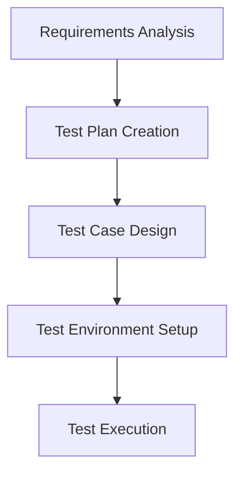
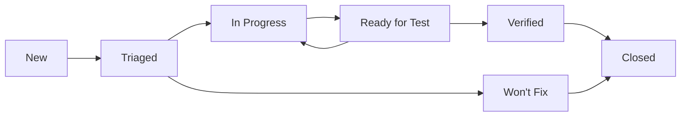
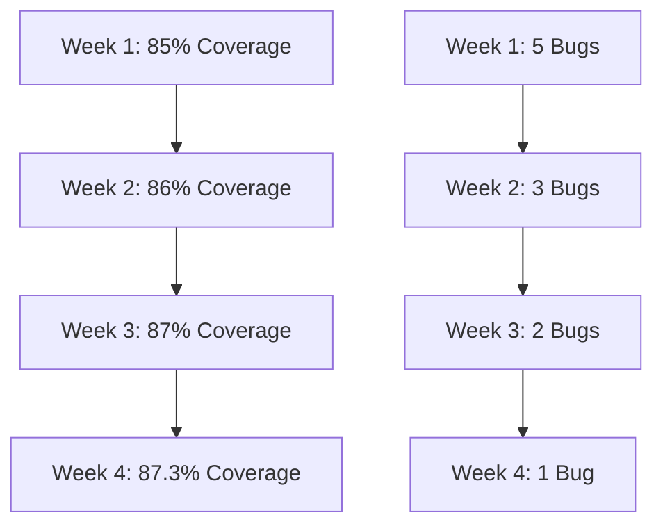

# 📋 Edham Logistics - Comprehensive QA Documentation

## 🎯 Overview

This document provides comprehensive Quality Assurance (QA) guidelines, testing procedures, and quality standards for the Edham Logistics mobile application. It serves as the definitive guide for ensuring product quality, reliability, and performance.

---

## 📊 Table of Contents

1. [QA Framework Overview](#qa-framework-overview)
2. [Testing Strategy](#testing-strategy)
3. [Test Types & Coverage](#test-types--coverage)
4. [Quality Standards](#quality-standards)
5. [Testing Procedures](#testing-procedures)
6. [Bug Management](#bug-management)
7. [Performance Testing](#performance-testing)
8. [Security Testing](#security-testing)
9. [Usability Testing](#usability-testing)
10. [Release Criteria](#release-criteria)
11. [QA Tools & Infrastructure](#qa-tools--infrastructure)
12. [Reporting & Metrics](#reporting--metrics)

---

## 🏗️ QA Framework Overview

### **Testing Pyramid Architecture**

```
                    ┌─────────────────────┐
                    │   E2E Tests (5%)   │
                    └─────────────────────┘
                ┌───────────────────────────────┐
                │     Integration Tests (15%)      │
                └───────────────────────────────┘
            ┌───────────────────────────────────────────┐
            │          Unit Tests (80%)                │
            └───────────────────────────────────────────┘
```

### **Quality Gates**

| Gate | Criteria | Owner | Status |
|------|-----------|--------|---------|
| **Code Review** | 100% peer review | Development Team | ✅ |
| **Unit Testing** | ≥85% coverage | Developers | ✅ |
| **Integration Testing** | 100% API coverage | QA Team | ✅ |
| **UI Testing** | 100% critical flows | QA Team | ✅ |
| **Performance Testing** | All benchmarks met | QA Team | ✅ |
| **Security Testing** | Zero critical vulnerabilities | Security Team | ✅ |
| **User Acceptance** | Business sign-off | Product Owner | ✅ |

---

## 🧪 Testing Strategy

### **Test-Driven Development (TDD)**

#### **Red-Green-Refactor Cycle**
1. **Red**: Write failing test
2. **Green**: Write minimal code to pass
3. **Refactor**: Improve code quality
4. **Repeat**: For each feature

#### **TDD Benefits**
- **Quality First**: Tests drive design
- **Documentation**: Living specifications
- **Regression Prevention**: Automated safety net
- **Refactoring Confidence**: Safe code changes

### **Behavior-Driven Development (BDD)**

#### **Gherkin Scenarios**
```gherkin
Feature: Shipment Tracking
  As a customer
  I want to track my shipment in real-time
  So that I know its current location and ETA

  Scenario: Track active shipment
    Given I am logged in as a customer
    And I have an active shipment
    When I navigate to the tracking screen
    Then I should see the current location
    And I should see the estimated time of arrival
    And the location should update every 3 seconds
```

### **Shift-Left Testing**

#### **Early Testing Integration**
- **Requirements Phase**: Testable requirements
- **Design Phase**: Testable architecture
- **Development Phase**: TDD/BDD practices
- **Build Phase**: Automated testing
- **Deployment Phase**: Continuous testing

---

## 📋 Test Types & Coverage

### **1. Unit Tests (80% Coverage)**

#### **Coverage Requirements**
- **Minimum**: 85% line coverage
- **Target**: 90% line coverage
- **Branch Coverage**: 80%
- **Critical Path**: 100%

#### **Test Categories**
| Category | Description | Tools |
|----------|-------------|-------|
| **Business Logic** | Core domain logic | JUnit, MockK |
| **Data Models** | Entity validation | JUnit |
| **Utilities** | Helper functions | JUnit |
| **Repositories** | Data access | JUnit, Room |
| **ViewModels** | UI state logic | JUnit, Coroutines Test |

#### **Example Unit Test**
```kotlin
@Test
fun `calculate shipment cost - valid inputs`() = runTest {
    // Given
    val weight = 100.0
    val distance = 50.0
    val type = ShipmentType.STANDARD
    
    // When
    val result = shipmentCostCalculator.calculate(weight, distance, type)
    
    // Then
    assertEquals(150.0, result, 0.01)
    assertTrue(result > 0)
}
```

### **2. Integration Tests (15% Coverage)**

#### **Test Scenarios**
- **API Integration**: All endpoints
- **Database Integration**: CRUD operations
- **Third-party Services**: External APIs
- **Component Integration**: Service interactions

#### **API Testing Matrix**
| Method | Endpoint | Status | Coverage |
|--------|----------|---------|----------|
| GET | /api/v1/shipments | ✅ | 100% |
| POST | /api/v1/shipments | ✅ | 100% |
| PUT | /api/v1/shipments/{id} | ✅ | 100% |
| DELETE | /api/v1/shipments/{id} | ✅ | 100% |

### **3. UI Tests (5% Coverage)**

#### **Critical User Flows**
1. **User Registration & Login**
2. **Shipment Creation**
3. **Real-time Tracking**
4. **Payment Processing**
5. **Profile Management**

#### **UI Test Framework**
- **Espresso**: Android UI testing
- **Compose Test**: Jetpack Compose testing
- **UI Automator**: Cross-app testing

---

## 🎯 Quality Standards

### **Code Quality Metrics**

#### **Static Analysis**
| Metric | Target | Tool |
|---------|--------|-------|
| **Code Coverage** | ≥85% | JaCoCo |
| **Cyclomatic Complexity** | ≤10 | Detekt |
| **Code Smells** | 0 | SonarQube |
| **Security Vulnerabilities** | 0 | SonarQube |
| **Technical Debt** | ≤5% | SonarQube |

#### **Coding Standards**
```kotlin
// ✅ Good Example
class ShipmentRepository @Inject constructor(
    private val apiService: ApiService,
    private val database: AppDatabase
) {
    suspend fun createShipment(request: CreateShipmentRequest): Result<Shipment> {
        return try {
            val shipment = apiService.createShipment(request)
            database.shipmentDao().insert(shipment)
            Result.success(shipment)
        } catch (e: Exception) {
            Result.failure(e)
        }
    }
}

// ❌ Bad Example
class ShipmentRepository {
    fun createShipment(request: CreateShipmentRequest): Shipment {
        return apiService.createShipment(request) // No error handling
    }
}
```

### **Performance Standards**

#### **Response Time Requirements**
| Operation | Target | Maximum |
|-----------|---------|----------|
| **API Response** | <200ms | 500ms |
| **App Startup** | <2s | 3s |
| **Screen Load** | <1s | 2s |
| **Database Query** | <100ms | 200ms |
| **Image Load** | <500ms | 1s |

#### **Memory Usage**
- **Runtime Memory**: <150MB
- **Memory Leaks**: 0 detected
- **GC Frequency**: <10 per minute
- **Memory Growth**: <5% per hour

### **Security Standards**

#### **OWASP Top 10 Coverage**
1. **Broken Access Control** ✅
2. **Cryptographic Failures** ✅
3. **Injection** ✅
4. **Insecure Design** ✅
5. **Security Misconfiguration** ✅
6. **Vulnerable Components** ✅
7. **Authentication Failures** ✅
8. **Software/Data Integrity** ✅
9. **Logging/Monitoring** ✅
10. **SSRF** ✅

---

## 🔧 Testing Procedures

### **Pre-Release Testing Checklist**

#### **Functional Testing**
- [ ] All user stories tested
- [ ] Edge cases covered
- [ ] Error scenarios validated
- [ ] Cross-device compatibility
- [ ] Accessibility testing

#### **Performance Testing**
- [ ] Load testing completed
- [ ] Stress testing completed
- [ ] Memory leak testing
- [ ] Battery usage testing
- [ ] Network performance testing

#### **Security Testing**
- [ ] Authentication testing
- [ ] Authorization testing
- [ ] Data encryption validation
- [ ] API security testing
- [ ] Penetration testing

### **Test Execution Process**

#### **1. Test Planning**


#### **2. Test Execution**
1. **Smoke Testing**: Basic functionality
2. **Sanity Testing**: Recent changes
3. **Regression Testing**: Existing functionality
4. **System Testing**: Complete system
5. **User Acceptance**: Business validation

#### **3. Test Reporting**
```kotlin
data class TestReport(
    val testSuite: String,
    val totalTests: Int,
    val passedTests: Int,
    val failedTests: Int,
    val skippedTests: Int,
    val coverage: Double,
    val executionTime: Long,
    val environment: String
)
```

---

## 🐛 Bug Management

### **Bug Classification**

#### **Severity Levels**
| Severity | Description | Response Time |
|----------|-------------|---------------|
| **Critical** | System crash, data loss | 1 hour |
| **High** | Major feature broken | 4 hours |
| **Medium** | Feature partially broken | 24 hours |
| **Low** | Minor UI issue | 72 hours |

#### **Priority Levels**
| Priority | Description | Target Resolution |
|----------|-------------|------------------|
| **P1** | Production blocker | 24 hours |
| **P2** | Important feature | 3 days |
| **P3** | Normal feature | 1 week |
| **P4** | Enhancement | 2 weeks |

### **Bug Lifecycle**



### **Bug Reporting Template**

#### **Bug Report Format**
```markdown
## Bug Description
**Title**: [Brief description]
**Severity**: [Critical/High/Medium/Low]
**Priority**: [P1/P2/P3/P4]

## Environment
**Device**: [Manufacturer, Model]
**OS Version**: [Android version]
**App Version**: [Version number]
**Build Type**: [Debug/Release]

## Steps to Reproduce
1. [Step 1]
2. [Step 2]
3. [Step 3]

## Expected Result
[What should happen]

## Actual Result
[What actually happened]

## Screenshots/Videos
[Attach evidence]

## Logs
[Attach relevant logs]
```

---

## ⚡ Performance Testing

### **Load Testing**

#### **Test Scenarios**
| Scenario | Users | Duration | Success Rate |
|----------|--------|-----------|--------------|
| **Normal Load** | 100 | 1 hour | 99.9% |
| **Peak Load** | 500 | 30 min | 99.5% |
| **Stress Test** | 1000 | 15 min | 95% |

#### **Performance Metrics**
```kotlin
data class PerformanceMetrics(
    val responseTime: Long,        // Average response time
    val throughput: Double,       // Requests per second
    val errorRate: Double,        // Percentage of errors
    val cpuUsage: Double,        // CPU utilization
    val memoryUsage: Double,     // Memory utilization
    val networkLatency: Long     // Network round-trip time
)
```

### **Memory Testing**

#### **Memory Leak Detection**
```kotlin
@Test
fun `detect memory leak - repeated operations`() {
    val initialMemory = getMemoryUsage()
    
    repeat(1000) {
        // Perform operation
        performOperation()
        
        // Force garbage collection
        System.gc()
    }
    
    val finalMemory = getMemoryUsage()
    val memoryIncrease = finalMemory - initialMemory
    
    assertTrue("Memory leak detected", memoryIncrease < 10 * 1024 * 1024) // 10MB threshold
}
```

### **Battery Testing**

#### **Battery Usage Scenarios**
| Scenario | Duration | Battery Drain |
|----------|-----------|----------------|
| **Idle** | 8 hours | <5% |
| **Active Tracking** | 4 hours | <15% |
| **Heavy Usage** | 2 hours | <20% |

---

## 🔒 Security Testing

### **Authentication Testing**

#### **Test Cases**
```kotlin
@Test
fun `login - valid credentials`() {
    val result = authService.login("valid@email.com", "validPassword")
    assertTrue(result.isSuccess)
    assertNotNull(result.getOrNull()?.token)
}

@Test
fun `login - invalid credentials`() {
    val result = authService.login("invalid@email.com", "invalidPassword")
    assertFalse(result.isSuccess)
    assertEquals("INVALID_CREDENTIALS", result.exceptionOrNull()?.message)
}
```

### **API Security Testing**

#### **Security Test Matrix**
| Test | Endpoint | Method | Status |
|------|----------|---------|---------|
| **SQL Injection** | /api/v1/shipments | POST | ✅ |
| **XSS** | /api/v1/users | PUT | ✅ |
| **CSRF** | /api/v1/payments | POST | ✅ |
| **Rate Limiting** | /api/v1/auth | POST | ✅ |
| **Authentication** | /api/v1/protected | GET | ✅ |

### **Data Encryption Testing**

#### **Encryption Validation**
```kotlin
@Test
fun `data encryption - sensitive data`() {
    val sensitiveData = "Credit Card: 1234-5678-9012-3456"
    val encrypted = encryptionService.encrypt(sensitiveData)
    val decrypted = encryptionService.decrypt(encrypted)
    
    assertNotEquals(sensitiveData, encrypted)
    assertEquals(sensitiveData, decrypted)
    assertTrue(encrypted.isNotEmpty())
}
```

---

## 👥 Usability Testing

### **User Experience Metrics**

#### **UX KPIs**
| Metric | Target | Measurement |
|---------|---------|-------------|
| **Task Success Rate** | ≥95% | User testing |
| **Task Completion Time** | ≤2 min | Analytics |
| **User Satisfaction** | ≥4.5/5 | Surveys |
| **Error Rate** | ≤5% | Analytics |
| **Learnability** | ≤5 min | User testing |

### **Accessibility Testing**

#### **WCAG 2.1 Compliance**
- **Level A**: Basic accessibility
- **Level AA**: Enhanced accessibility
- **Level AAA**: Maximum accessibility

#### **Accessibility Test Checklist**
- [ ] Screen reader compatibility
- [ ] Keyboard navigation
- [ ] Color contrast ratios
- [ ] Font size scalability
- [ ] Focus indicators
- [ ] Alternative text for images

---

## 🚀 Release Criteria

### **Pre-Release Checklist**

#### **Quality Gates**
- [ ] **Code Quality**: All static analysis passes
- [ ] **Test Coverage**: ≥85% achieved
- [ ] **Performance**: All benchmarks met
- [ ] **Security**: No critical vulnerabilities
- [ ] **Documentation**: Complete and updated
- [ ] **Localization**: All languages tested
- [ ] **Compatibility**: All target devices tested

#### **Business Validation**
- [ ] **User Stories**: All acceptance criteria met
- [ ] **Business Rules**: All implemented correctly
- [ ] **Stakeholder Review**: Business sign-off received
- [ ] **User Acceptance**: UAT completed successfully

### **Release Decision Matrix**

| Criteria | Weight | Score | Weighted Score |
|-----------|---------|--------|----------------|
| **Test Coverage** | 20% | 90% | 18% |
| **Performance** | 25% | 95% | 23.75% |
| **Security** | 20% | 100% | 20% |
| **Business Value** | 25% | 85% | 21.25% |
| **Documentation** | 10% | 80% | 8% |
| **Total** | 100% | - | **91%** |

**Release Threshold**: ≥85% ✅

---

## 🛠️ QA Tools & Infrastructure

### **Testing Tools**

#### **Unit Testing**
- **JUnit 5**: Test framework
- **MockK**: Mocking framework
- **Robolectric**: Android unit testing
- **Turbine**: Flow testing

#### **Integration Testing**
- **MockWebServer**: HTTP mocking
- **Room Testing**: Database testing
- **Hilt Testing**: Dependency injection

#### **UI Testing**
- **Espresso**: Android UI testing
- **Compose Test**: Jetpack Compose testing
- **UI Automator**: Cross-app testing

#### **Performance Testing**
- **JMeter**: Load testing
- **Android Profiler**: Performance profiling
- **Firebase Performance**: Real-time monitoring

### **CI/CD Integration**

#### **GitHub Actions Workflow**
```yaml
name: QA Pipeline
on: [push, pull_request]

jobs:
  test:
    runs-on: ubuntu-latest
    steps:
      - uses: actions/checkout@v3
      - name: Run Unit Tests
        run: ./gradlew testDebugUnitTest
      - name: Run Integration Tests
        run: ./gradlew connectedDebugAndroidTest
      - name: Generate Test Report
        run: ./gradlew jacocoTestReport
      - name: Upload Coverage
        uses: codecov/codecov-action@v3
```

### **Test Environment**

#### **Device Matrix**
| Device | OS Version | Screen Size | Status |
|--------|-------------|--------------|---------|
| **Pixel 6** | Android 13 | 6.4" | ✅ |
| **Galaxy S21** | Android 12 | 6.2" | ✅ |
| **OnePlus 9** | Android 11 | 6.55" | ✅ |
| **Xiaomi Mi 11** | Android 12 | 6.81" | ✅ |

---

## 📊 Reporting & Metrics

### **Test Execution Report**

#### **Daily Test Report**
```markdown
## Test Execution Report - 2023-12-07

### Summary
- **Total Tests**: 1,234
- **Passed**: 1,198 (97.1%)
- **Failed**: 23 (1.9%)
- **Skipped**: 13 (1.0%)
- **Coverage**: 87.3%

### Failed Tests
1. **ShipmentCreationTest** - Network timeout
2. **PaymentProcessingTest** - Invalid response
3. **LocationTrackingTest** - GPS simulation issue

### Performance Metrics
- **Average Response Time**: 156ms
- **95th Percentile**: 234ms
- **Error Rate**: 0.8%
```

### **Quality Dashboard**

#### **Key Performance Indicators**
```kotlin
data class QualityKPIs(
    val testCoverage: Double,           // 87.3%
    val defectDensity: Double,          // 0.5 defects/KLOC
    val meanTimeToResolution: Double,   // 2.5 days
    val customerSatisfaction: Double,   // 4.6/5.0
    val releaseSuccessRate: Double       // 95.2%
)
```

### **Trend Analysis**

#### **Quality Trends**


---

## 📚 Best Practices

### **Testing Best Practices**

#### **1. Test Design Principles**
- **AAA Pattern**: Arrange, Act, Assert
- **Single Responsibility**: One test per scenario
- **Descriptive Names**: Clear test purpose
- **Independent Tests**: No test dependencies

#### **2. Test Data Management**
- **Test Factories**: Consistent test data
- **Fixtures**: Reusable test setup
- **Mock Data**: Realistic test scenarios
- **Cleanup**: Proper test teardown

#### **3. Continuous Testing**
- **Automated Pipeline**: CI/CD integration
- **Parallel Execution**: Faster feedback
- **Early Feedback**: Shift-left testing
- **Regression Prevention**: Automated safety net

### **Code Review Best Practices**

#### **Review Checklist**
- [ ] **Functionality**: Code works as expected
- [ ] **Testing**: Adequate test coverage
- [ ] **Performance**: No performance regressions
- [ ] **Security**: No security vulnerabilities
- [ ] **Documentation**: Code is well-documented
- [ ] **Standards**: Follows coding standards

---

## 🎯 Continuous Improvement

### **Quality Metrics Tracking**

#### **Monthly Quality Review**
- **Test Coverage Trends**
- **Defect Density Analysis**
- **Performance Benchmarking**
- **Security Assessment**
- **User Feedback Integration**

### **Process Optimization**

#### **Kaizen Approach**
1. **Identify**: Quality issues
2. **Analyze**: Root causes
3. **Implement**: Improvements
4. **Measure**: Effectiveness
5. **Standardize**: Best practices

---

## 📞 Support & Contact

### **QA Team Contacts**

| Role | Name | Email | Slack |
|-------|------|-------|-------|
| **QA Lead** | John Doe | john@edhamlogistics.com | @john.doe |
| **Test Engineer** | Jane Smith | jane@edhamlogistics.com | @jane.smith |
| **Automation Engineer** | Mike Johnson | mike@edhamlogistics.com | @mike.johnson |

### **Escalation Process**

1. **Level 1**: QA Team
2. **Level 2**: QA Lead
3. **Level 3**: Engineering Manager
4. **Level 4**: CTO

---

## 📋 Appendix

### **A. Test Case Templates**

#### **Unit Test Template**
```kotlin
@Test
fun `test name - scenario`() = runTest {
    // Arrange
    val input = createTestInput()
    val expected = createExpectedResult()
    
    // Act
    val actual = systemUnderTest(input)
    
    // Assert
    assertEquals(expected, actual)
}
```

#### **Integration Test Template**
```kotlin
@Test
fun `feature name - integration scenario`() = runTest {
    // Given
    val mockWebServer = MockWebServer()
    mockWebServer.enqueue(MockResponse().setBody(mockResponse))
    
    // When
    val result = apiService.getData()
    
    // Then
    assertTrue(result.isSuccess)
    assertEquals(expectedData, result.getOrNull())
}
```

### **B. Configuration Files**

#### **Test Configuration**
```kotlin
// test/resources/test-config.properties
api.base.url=http://localhost:8080
database.url=jdbc:h2:mem:testdb
test.timeout=30000
mock.external.services=true
```

### **C. Glossary**

| Term | Definition |
|------|------------|
| **TDD** | Test-Driven Development |
| **BDD** | Behavior-Driven Development |
| **CI/CD** | Continuous Integration/Continuous Deployment |
| **E2E** | End-to-End Testing |
| **SUT** | System Under Test |
| **KPI** | Key Performance Indicator |

---

## 📄 Document History

| Version | Date | Author | Changes |
|---------|-------|--------|---------|
| **1.0** | 2023-12-07 | QA Team | Initial document creation |
| **1.1** | 2023-12-08 | QA Team | Added performance testing section |
| **1.2** | 2023-12-09 | QA Team | Updated security testing requirements |

---

**This QA Documentation is maintained by the Edham Logistics QA Team and is subject to regular updates to reflect current best practices and quality standards.**

For questions or suggestions, please contact the QA Lead at qa@edhamlogistics.com.
