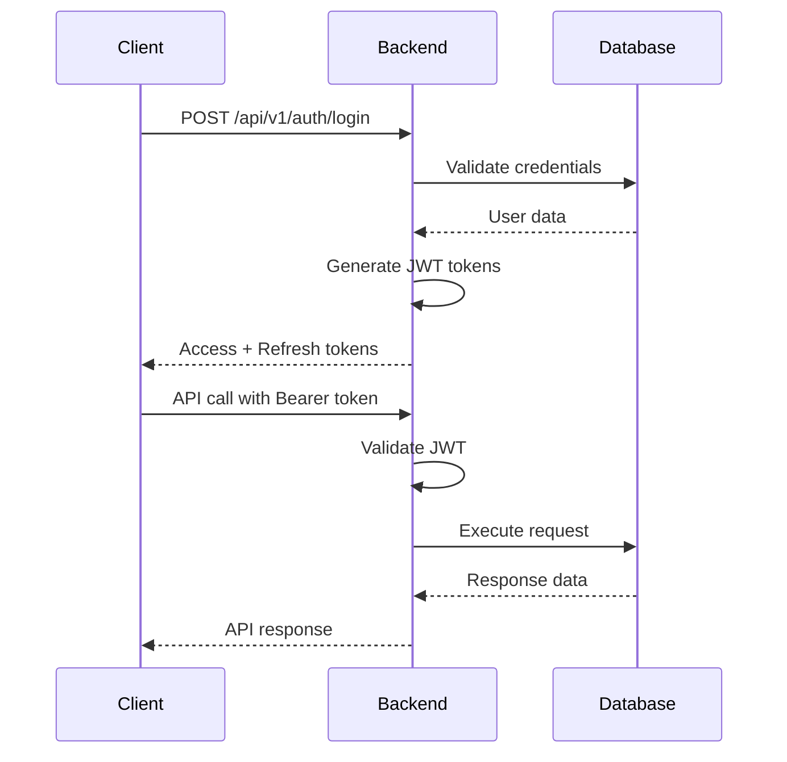

# Edham Logistics Backend - Integration Guide

## 📋 Overview

This guide provides comprehensive instructions for integrating the Edham Logistics backend API with various client applications, including Android, iOS, and web applications.

## 🔌 Authentication & Authorization

### JWT Token Structure
```json
{
  "sub": "user_id",
  "email": "user@example.com",
  "role": "CUSTOMER|DRIVER|SUPERVISOR|ACCOUNTANT|WORKSHOP|ADMIN",
  "permissions": ["SHIPMENT_READ", "SHIPMENT_CREATE", ...],
  "organizationId": "org_id",
  "iat": 1640995200,
  "exp": 1640998800
}
```

### Authentication Flow


## 📱 Mobile Application Integration

### Android Integration

#### 1. Dependencies (build.gradle)
```gradle
dependencies {
    // Network
    implementation 'com.squareup.retrofit2:retrofit:2.9.0'
    implementation 'com.squareup.retrofit2:converter-gson:2.9.0'
    implementation 'com.squareup.okhttp3:logging-interceptor:4.10.0'
    
    // JWT
    implementation 'io.jsonwebtoken:jjwt-api:0.12.3'
    implementation 'io.jsonwebtoken:jjwt-impl:0.12.3'
    implementation 'io.jsonwebtoken:jjwt-jackson:0.12.3'
    
    // WebSocket
    implementation 'org.java-websocket:Java-WebSocket:1.5.4'
    
    // Image Loading
    implementation 'com.github.bumptech.glide:glide:4.14.2'
}
```

#### 2. API Service Setup
```kotlin
// ApiService.kt
interface ApiService {
    @POST("/api/v1/auth/login")
    suspend fun login(@Body request: LoginRequest): Response<LoginResponse>
    
    @GET("/api/v1/shipments")
    suspend fun getShipments(
        @Header("Authorization") token: String,
        @Query("page") page: Int,
        @Query("size") size: Int
    ): Response<PagedResponse<Shipment>>
    
    @POST("/api/v1/shipments")
    suspend fun createShipment(
        @Header("Authorization") token: String,
        @Body request: CreateShipmentRequest
    ): Response<Shipment>
    
    @PUT("/api/v1/shipments/{id}")
    suspend fun updateShipment(
        @Header("Authorization") token: String,
        @Path("id") id: Long,
        @Body request: UpdateShipmentRequest
    ): Response<Shipment>
}
```

#### 3. Token Management
```kotlin
// TokenManager.kt
class TokenManager(private val context: Context) {
    private val prefs = context.getSharedPreferences("auth_prefs", Context.MODE_PRIVATE)
    
    fun saveTokens(accessToken: String, refreshToken: String) {
        prefs.edit()
            .putString("access_token", accessToken)
            .putString("refresh_token", refreshToken)
            .apply()
    }
    
    fun getAccessToken(): String? = prefs.getString("access_token", null)
    
    fun getRefreshToken(): String? = prefs.getString("refresh_token", null)
    
    fun clearTokens() {
        prefs.edit().clear().apply()
    }
    
    fun isTokenExpired(token: String): Boolean {
        return try {
            val jwt = Jwts.parserBuilder()
                .setSigningKey(getSigningKey())
                .build()
                .parseClaimsJws(token)
            jwt.body.expiration.before(Date())
        } catch (e: Exception) {
            true
        }
    }
}
```

#### 4. Retrofit Client Setup
```kotlin
// RetrofitClient.kt
object RetrofitClient {
    private const val BASE_URL = "https://api.edham-logistics.com/"
    
    val apiService: ApiService by lazy {
        val logging = HttpLoggingInterceptor().apply {
            level = if (BuildConfig.DEBUG) {
                HttpLoggingInterceptor.Level.BODY
            } else {
                HttpLoggingInterceptor.Level.NONE
            }
        }
        
        val client = OkHttpClient.Builder()
            .addInterceptor(AuthInterceptor())
            .addInterceptor(logging)
            .connectTimeout(30, TimeUnit.SECONDS)
            .readTimeout(30, TimeUnit.SECONDS)
            .build()
        
        Retrofit.Builder()
            .baseUrl(BASE_URL)
            .client(client)
            .addConverterFactory(GsonConverterFactory.create())
            .build()
            .create(ApiService::class.java)
    }
    
    class AuthInterceptor : Interceptor {
        override fun intercept(chain: Interceptor.Chain): Response {
            val tokenManager = TokenManager(chain.request().tag(Context::class.java) as? Context)
            val token = tokenManager?.getAccessToken()
            
            return if (token != null) {
                val newRequest = chain.request().newBuilder()
                    .addHeader("Authorization", "Bearer $token")
                    .build()
                chain.proceed(newRequest)
            } else {
                chain.proceed(chain.request())
            }
        }
    }
}
```

#### 5. WebSocket Integration
```kotlin
// WebSocketManager.kt
class WebSocketManager {
    private var webSocket: WebSocket? = null
    private val messageHandlers = mutableMapOf<String, (String) -> Unit>()
    
    fun connect(token: String) {
        val uri = URI("wss://api.edham-logistics.com/ws/tracking")
        val client = OkHttpClient()
        
        val request = Request.Builder()
            .url(uri.toString())
            .addHeader("Authorization", "Bearer $token")
            .build()
        
        webSocket = client.newWebSocket(request, object : WebSocketListener() {
            override fun onOpen(webSocket: WebSocket, response: Response) {
                Log.d("WebSocket", "Connected")
            }
            
            override fun onMessage(webSocket: WebSocket, text: String) {
                handleMessage(text)
            }
            
            override fun onFailure(webSocket: WebSocket, t: Throwable, response: Response?) {
                Log.e("WebSocket", "Error: ${t.message}")
            }
        })
    }
    
    private fun handleMessage(message: String) {
        try {
            val json = JSONObject(message)
            val type = json.getString("type")
            messageHandlers[type]?.invoke(message)
        } catch (e: Exception) {
            Log.e("WebSocket", "Error parsing message: ${e.message}")
        }
    }
    
    fun subscribe(type: String, handler: (String) -> Unit) {
        messageHandlers[type] = handler
    }
}
```

### iOS Integration

#### 1. Dependencies (Package.swift)
```swift
// Package.swift
dependencies: [
    .package(url: "https://github.com/Alamofire/Alamofire.git", from: "5.6.0"),
    .package(url: "https://github.com/onevcat/Kingfisher.git", from: "7.6.0"),
    .package(url: "https://github.com/daltoniam/Starscream.git", from: "4.0.0")
]
```

#### 2. API Service Setup
```swift
// APIService.swift
import Alamofire
import Foundation

class APIService {
    static let shared = APIService()
    private let baseURL = "https://api.edham-logistics.com/api/v1"
    
    private init() {}
    
    // MARK: - Authentication
    func login(email: String, password: String, completion: @escaping (Result<LoginResponse, AFError>) -> Void) {
        let parameters = LoginRequest(email: email, password: password)
        
        AF.request("\(baseURL)/auth/login",
                  method: .post,
                  parameters: parameters,
                  encoding: JSONEncoding.default)
            .responseDecodable(of: LoginResponse.self) { response in
                switch response.result {
                case .success(let loginResponse):
                    completion(.success(loginResponse))
                case .failure(let error):
                    completion(.failure(error))
                }
            }
    }
    
    // MARK: - Shipments
    func getShipments(page: Int = 0, size: Int = 20, completion: @escaping (Result<PagedResponse<Shipment>, AFError>) -> Void) {
        let headers = HTTPHeaders([HTTPHeader.authorization(bearerToken: TokenManager.shared.accessToken)])
        
        AF.request("\(baseURL)/shipments",
                  method: .get,
                  parameters: ["page": page, "size": size],
                  headers: headers)
            .responseDecodable(of: PagedResponse<Shipment>.self) { response in
                switch response.result {
                case .success(let shipmentsResponse):
                    completion(.success(shipmentsResponse))
                case .failure(let error):
                    completion(.failure(error))
                }
            }
    }
    
    func createShipment(_ shipment: CreateShipmentRequest, completion: @escaping (Result<Shipment, AFError>) -> Void) {
        let headers = HTTPHeaders([HTTPHeader.authorization(bearerToken: TokenManager.shared.accessToken)])
        
        AF.request("\(baseURL)/shipments",
                  method: .post,
                  parameters: shipment,
                  encoding: JSONEncoding.default,
                  headers: headers)
            .responseDecodable(of: Shipment.self) { response in
                switch response.result {
                case .success(let shipment):
                    completion(.success(shipment))
                case .failure(let error):
                    completion(.failure(error))
                }
            }
    }
}
```

#### 3. Token Management
```swift
// TokenManager.swift
import Foundation
import KeychainAccess

class TokenManager {
    static let shared = TokenManager()
    
    private let keychain = Keychain(service: "com.edham.logistics")
    private let accessTokenKey = "access_token"
    private let refreshTokenKey = "refresh_token"
    
    private init() {}
    
    func saveTokens(accessToken: String, refreshToken: String) {
        do {
            try keychain.set(accessToken, key: accessTokenKey)
            try keychain.set(refreshToken, key: refreshTokenKey)
        } catch {
            print("Error saving tokens: \(error)")
        }
    }
    
    var accessToken: String {
        do {
            return try keychain.get(accessTokenKey) ?? ""
        } catch {
            print("Error getting access token: \(error)")
            return ""
        }
    }
    
    var refreshToken: String {
        do {
            return try keychain.get(refreshTokenKey) ?? ""
        } catch {
            print("Error getting refresh token: \(error)")
            return ""
        }
    }
    
    func clearTokens() {
        do {
            try keychain.remove(accessTokenKey)
            try keychain.remove(refreshTokenKey)
        } catch {
            print("Error clearing tokens: \(error)")
        }
    }
    
    func isTokenExpired(_ token: String) -> Bool {
        guard let data = token.data(using: .utf8),
              let jwt = try? JSONDecoder().decode(JWTToken.self, from: data) else {
            return true
        }
        
        return jwt.exp < Date().timeIntervalSince1970
    }
}
```

#### 4. WebSocket Integration
```swift
// WebSocketManager.swift
import Foundation
import Starscream

class WebSocketManager: WebSocketDelegate {
    static let shared = WebSocketManager()
    
    private var socket: WebSocket?
    private var messageHandlers: [String: (String) -> Void] = [:]
    
    private init() {}
    
    func connect(token: String) {
        var request = URLRequest(url: URL(string: "wss://api.edham-logistics.com/ws/tracking")!)
        request.setValue("Bearer \(token)", forHTTPHeaderField: "Authorization")
        
        socket = WebSocket(request: request)
        socket?.delegate = self
        socket?.connect()
    }
    
    func didReceive(event: WebSocketEvent, client: WebSocket) {
        switch event {
        case .connected:
            print("WebSocket connected")
        case .disconnected(let reason, let code):
            print("WebSocket disconnected: \(reason) with code: \(code)")
        case .text(let string):
            handleMessage(string)
        case .binary:
            break
        case .ping, .pong, .viabilityChanged:
            break
        case .reconnectSuggested, .cancelled:
            break
        }
    }
    
    private func handleMessage(_ message: String) {
        guard let data = message.data(using: .utf8),
              let json = try? JSONSerialization.jsonObject(with: data) as? [String: Any],
              let type = json["type"] as? String else {
            return
        }
        
        messageHandlers[type]?(message)
    }
    
    func subscribe(to type: String, handler: @escaping (String) -> Void) {
        messageHandlers[type] = handler
    }
}
```

## 🌐 Web Application Integration

### React Integration

#### 1. Dependencies (package.json)
```json
{
  "dependencies": {
    "axios": "^1.4.0",
    "socket.io-client": "^4.7.2",
    "@reduxjs/toolkit": "^1.9.5",
    "react-redux": "^8.1.1",
    "react-router-dom": "^6.8.0"
  }
}
```

#### 2. API Service Setup
```javascript
// services/api.js
import axios from 'axios';

const API_BASE_URL = process.env.REACT_APP_API_URL || 'https://api.edham-logistics.com/api/v1';

class ApiService {
  constructor() {
    this.client = axios.create({
      baseURL: API_BASE_URL,
      timeout: 30000,
    });

    // Request interceptor for auth token
    this.client.interceptors.request.use(
      (config) => {
        const token = localStorage.getItem('access_token');
        if (token) {
          config.headers.Authorization = `Bearer ${token}`;
        }
        return config;
      },
      (error) => Promise.reject(error)
    );

    // Response interceptor for token refresh
    this.client.interceptors.response.use(
      (response) => response,
      async (error) => {
        const originalRequest = error.config;
        
        if (error.response?.status === 401 && !originalRequest._retry) {
          originalRequest._retry = true;
          
          try {
            await this.refreshToken();
            const token = localStorage.getItem('access_token');
            originalRequest.headers.Authorization = `Bearer ${token}`;
            
            return this.client(originalRequest);
          } catch (refreshError) {
            this.logout();
            return Promise.reject(refreshError);
          }
        }
        
        return Promise.reject(error);
      }
    );
  }

  // Authentication
  async login(credentials) {
    const response = await this.client.post('/auth/login', credentials);
    const { accessToken, refreshToken, user } = response.data.data;
    
    localStorage.setItem('access_token', accessToken);
    localStorage.setItem('refresh_token', refreshToken);
    localStorage.setItem('user', JSON.stringify(user));
    
    return response.data;
  }

  async refreshToken() {
    const refreshToken = localStorage.getItem('refresh_token');
    const response = await this.client.post('/auth/refresh', { refreshToken });
    
    const { accessToken } = response.data.data;
    localStorage.setItem('access_token', accessToken);
    
    return accessToken;
  }

  logout() {
    localStorage.removeItem('access_token');
    localStorage.removeItem('refresh_token');
    localStorage.removeItem('user');
    window.location.href = '/login';
  }

  // Shipments
  async getShipments(params = {}) {
    const response = await this.client.get('/shipments', { params });
    return response.data;
  }

  async createShipment(shipmentData) {
    const response = await this.client.post('/shipments', shipmentData);
    return response.data;
  }

  async updateShipment(id, shipmentData) {
    const response = await this.client.put(`/shipments/${id}`, shipmentData);
    return response.data;
  }

  async deleteShipment(id) {
    const response = await this.client.delete(`/shipments/${id}`);
    return response.data;
  }
}

export default new ApiService();
```

#### 3. WebSocket Integration
```javascript
// services/websocket.js
import io from 'socket.io-client';

class WebSocketService {
  constructor() {
    this.socket = null;
    this.listeners = {};
  }

  connect(token) {
    this.socket = io(process.env.REACT_APP_WS_URL || 'wss://api.edham-logistics.com', {
      auth: {
        token: token
      }
    });

    this.socket.on('connect', () => {
      console.log('WebSocket connected');
    });

    this.socket.on('disconnect', () => {
      console.log('WebSocket disconnected');
    });

    this.socket.on('message', (message) => {
      this.handleMessage(message);
    });
  }

  handleMessage(message) {
    const { type, data } = message;
    if (this.listeners[type]) {
      this.listeners[type].forEach(callback => callback(data));
    }
  }

  subscribe(event, callback) {
    if (!this.listeners[event]) {
      this.listeners[event] = [];
    }
    this.listeners[event].push(callback);
  }

  unsubscribe(event, callback) {
    if (this.listeners[event]) {
      this.listeners[event] = this.listeners[event].filter(cb => cb !== callback);
    }
  }

  emit(event, data) {
    if (this.socket) {
      this.socket.emit(event, data);
    }
  }

  disconnect() {
    if (this.socket) {
      this.socket.disconnect();
      this.socket = null;
    }
  }
}

export default new WebSocketService();
```

#### 4. Redux Integration
```javascript
// store/slices/authSlice.js
import { createSlice, createAsyncThunk } from '@reduxjs/toolkit';
import apiService from '../services/api';

// Async thunks
export const loginUser = createAsyncThunk(
  'auth/login',
  async (credentials, { rejectWithValue }) => {
    try {
      const response = await apiService.login(credentials);
      return response;
    } catch (error) {
      return rejectWithValue(error.response.data);
    }
  }
);

export const refreshToken = createAsyncThunk(
  'auth/refresh',
  async (_, { rejectWithValue }) => {
    try {
      const response = await apiService.refreshToken();
      return response;
    } catch (error) {
      return rejectWithValue(error.response.data);
    }
  }
);

// Slice
const authSlice = createSlice({
  name: 'auth',
  initialState: {
    user: null,
    token: null,
    refreshToken: null,
    isLoading: false,
    error: null
  },
  reducers: {
    logout: (state) => {
      state.user = null;
      state.token = null;
      state.refreshToken = null;
      apiService.logout();
    }
  },
  extraReducers: (builder) => {
    builder
      .addCase(loginUser.pending, (state) => {
        state.isLoading = true;
        state.error = null;
      })
      .addCase(loginUser.fulfilled, (state, action) => {
        state.isLoading = false;
        state.user = action.payload.user;
        state.token = action.payload.accessToken;
        state.refreshToken = action.payload.refreshToken;
      })
      .addCase(loginUser.rejected, (state, action) => {
        state.isLoading = false;
        state.error = action.payload;
      });
  }
});

export const { logout } = authSlice.actions;
export default authSlice.reducer;
```

## 🔌 API Endpoints Reference

### Authentication Endpoints
```
POST /api/v1/auth/login
POST /api/v1/auth/register
POST /api/v1/auth/refresh
POST /api/v1/auth/logout
GET  /api/v1/auth/me
POST /api/v1/auth/forgot-password
POST /api/v1/auth/reset-password
```

### Shipment Endpoints
```
GET    /api/v1/shipments
POST   /api/v1/shipments
GET    /api/v1/shipments/{id}
PUT    /api/v1/shipments/{id}
DELETE /api/v1/shipments/{id}
GET    /api/v1/shipments/{id}/tracking
PUT    /api/v1/shipments/{id}/status
POST   /api/v1/shipments/{id}/assign
```

### Tracking Endpoints
```
GET  /api/v1/tracking/shipment/{shipmentId}
POST /api/v1/tracking/shipment/{shipmentId}
PUT  /api/v1/tracking/driver/location
GET  /api/v1/tracking/driver/{driverId}/location
```

### Invoice Endpoints
```
GET  /api/v1/invoices
POST /api/v1/invoices
GET  /api/v1/invoices/{id}
PUT  /api/v1/invoices/{id}
GET  /api/v1/invoices/{id}/pdf
POST /api/v1/invoices/{id}/pay
```

### Mobile-Specific Endpoints
```
POST /api/v1/mobile/customer/orders
GET  /api/v1/mobile/customer/orders
GET  /api/v1/mobile/driver/active-task
PUT  /api/v1/mobile/driver/location
PATCH /api/v1/mobile/driver/orders/{id}/status
POST /api/v1/mobile/driver/orders/{id}/proof
```

## 🔄 Error Handling

### Standard Error Response Format
```json
{
  "success": false,
  "error": {
    "code": "SHIPMENT_NOT_FOUND",
    "message": "Shipment not found",
    "details": {
      "shipmentId": 12345
    }
  },
  "timestamp": "2023-12-01T10:30:00Z",
  "path": "/api/v1/shipments/12345"
}
```

### Error Codes Reference
```javascript
const ERROR_CODES = {
  // Authentication errors
  INVALID_CREDENTIALS: 'INVALID_CREDENTIALS',
  TOKEN_EXPIRED: 'TOKEN_EXPIRED',
  TOKEN_INVALID: 'TOKEN_INVALID',
  
  // Authorization errors
  ACCESS_DENIED: 'ACCESS_DENIED',
  INSUFFICIENT_PERMISSIONS: 'INSUFFICIENT_PERMISSIONS',
  
  // Shipment errors
  SHIPMENT_NOT_FOUND: 'SHIPMENT_NOT_FOUND',
  SHIPMENT_ALREADY_DELIVERED: 'SHIPMENT_ALREADY_DELIVERED',
  INVALID_SHIPMENT_STATUS: 'INVALID_SHIPMENT_STATUS',
  
  // Validation errors
  VALIDATION_ERROR: 'VALIDATION_ERROR',
  MISSING_REQUIRED_FIELD: 'MISSING_REQUIRED_FIELD',
  INVALID_FORMAT: 'INVALID_FORMAT',
  
  // System errors
  INTERNAL_SERVER_ERROR: 'INTERNAL_SERVER_ERROR',
  DATABASE_ERROR: 'DATABASE_ERROR',
  EXTERNAL_SERVICE_ERROR: 'EXTERNAL_SERVICE_ERROR'
};
```

## 📊 Real-time Updates

### WebSocket Events
```javascript
// Shipment updates
{
  "type": "SHIPMENT_STATUS_UPDATE",
  "data": {
    "shipmentId": 12345,
    "oldStatus": "IN_TRANSIT",
    "newStatus": "DELIVERED",
    "timestamp": "2023-12-01T10:30:00Z"
  }
}

// Location updates
{
  "type": "DRIVER_LOCATION_UPDATE",
  "data": {
    "driverId": 678,
    "shipmentId": 12345,
    "latitude": 24.7136,
    "longitude": 46.6753,
    "timestamp": "2023-12-01T10:30:00Z"
  }
}

// Notifications
{
  "type": "NOTIFICATION",
  "data": {
    "userId": 123,
    "type": "SHIPMENT_DELIVERED",
    "title": "Shipment Delivered",
    "message": "Your shipment has been delivered successfully",
    "data": {
      "shipmentId": 12345
    }
  }
}
```

## 🔧 Testing Integration

### Unit Tests
```javascript
// __tests__/api.test.js
import ApiService from '../services/api';
import MockAdapter from 'axios-mock-adapter';

describe('ApiService', () => {
  let api;
  let mock;

  beforeEach(() => {
    mock = new MockAdapter(api.client);
  });

  test('should login successfully', async () => {
    const mockResponse = {
      data: {
        success: true,
        data: {
          accessToken: 'mock-token',
          refreshToken: 'mock-refresh-token',
          user: { id: 1, email: 'test@example.com' }
        }
      }
    };

    mock.onPost('/auth/login').reply(200, mockResponse);

    const result = await api.login({
      email: 'test@example.com',
      password: 'password'
    });

    expect(result.data.user.email).toBe('test@example.com');
    expect(localStorage.getItem('access_token')).toBe('mock-token');
  });

  test('should handle login error', async () => {
    const mockResponse = {
      data: {
        success: false,
        error: {
          code: 'INVALID_CREDENTIALS',
          message: 'Invalid credentials'
        }
      }
    };

    mock.onPost('/auth/login').reply(401, mockResponse);

    await expect(api.login({
      email: 'test@example.com',
      password: 'wrong-password'
    })).rejects.toThrow();
  });
});
```

### Integration Tests
```javascript
// __tests__/integration/shipment.test.js
import request from 'supertest';
import app from '../../src/app';

describe('Shipment Integration', () => {
  let authToken;

  beforeAll(async () => {
    const response = await request(app)
      .post('/api/v1/auth/login')
      .send({
        email: 'test@example.com',
        password: 'password'
      });
    
    authToken = response.body.data.accessToken;
  });

  test('should create shipment', async () => {
    const shipmentData = {
      originAddress: '123 Main St',
      destinationAddress: '456 Oak Ave',
      weight: 10.5,
      dimensions: { length: 10, width: 5, height: 3 }
    };

    const response = await request(app)
      .post('/api/v1/shipments')
      .set('Authorization', `Bearer ${authToken}`)
      .send(shipmentData)
      .expect(201);

    expect(response.body.data).toMatchObject(shipmentData);
  });

  test('should get shipments', async () => {
    const response = await request(app)
      .get('/api/v1/shipments')
      .set('Authorization', `Bearer ${authToken}`)
      .expect(200);

    expect(response.body.data).toBeInstanceOf(Array);
  });
});
```

## 🚀 Deployment Considerations

### Environment Configuration
```javascript
// config/environments.js
const environments = {
  development: {
    apiUrl: 'http://localhost:8080/api/v1',
    wsUrl: 'ws://localhost:8080/ws',
    timeout: 30000
  },
  staging: {
    apiUrl: 'https://staging-api.edham-logistics.com/api/v1',
    wsUrl: 'wss://staging-api.edham-logistics.com/ws',
    timeout: 30000
  },
  production: {
    apiUrl: 'https://api.edham-logistics.com/api/v1',
    wsUrl: 'wss://api.edham-logistics.com/ws',
    timeout: 30000
  }
};

const currentEnv = process.env.NODE_ENV || 'development';
export default environments[currentEnv];
```

### Rate Limiting
```javascript
// utils/rateLimiter.js
class RateLimiter {
  constructor(maxRequests = 100, windowMs = 60000) {
    this.maxRequests = maxRequests;
    this.windowMs = windowMs;
    this.requests = [];
  }

  async makeRequest(requestFn) {
    const now = Date.now();
    const windowStart = now - this.windowMs;
    
    // Remove old requests
    this.requests = this.requests.filter(time => time > windowStart);
    
    if (this.requests.length >= this.maxRequests) {
      const waitTime = this.windowMs - (now - this.requests[0]);
      await new Promise(resolve => setTimeout(resolve, waitTime));
    }
    
    this.requests.push(now);
    return requestFn();
  }
}

export default new RateLimiter();
```

## 📱 Platform-Specific Considerations

### Android
- Use `WorkManager` for background sync
- Implement `JobScheduler` for periodic tasks
- Handle network connectivity changes
- Use `Room` for local caching

### iOS
- Use `URLSession` for network requests
- Implement `BackgroundTasks` for background sync
- Handle app lifecycle events
- Use `CoreData` for local caching

### Web
- Implement service worker for offline support
- Use IndexedDB for local storage
- Handle browser compatibility
- Implement PWA features

## 🔒 Security Best Practices

### Token Storage
- **Android**: Use Android Keystore or EncryptedSharedPreferences
- **iOS**: Use Keychain Services
- **Web**: Use httpOnly cookies or secure localStorage

### Network Security
- Always use HTTPS
- Implement certificate pinning
- Validate SSL certificates
- Use certificate transparency

### Data Validation
- Validate all input on client side
- Sanitize data before sending
- Use parameterized queries
- Implement XSS protection

## 📞 Support and Troubleshooting

### Common Issues
1. **CORS Errors**: Ensure backend allows your domain
2. **Token Expiration**: Implement automatic token refresh
3. **Network Timeouts**: Configure appropriate timeout values
4. **WebSocket Connection**: Check firewall and proxy settings

### Debug Mode
```javascript
// Enable debug logging
if (process.env.NODE_ENV === 'development') {
  console.log('API Debug Mode Enabled');
  // Add additional logging
}
```

### Support Channels
- **Documentation**: https://docs.edham-logistics.com
- **API Status**: https://status.edham-logistics.com
- **Support**: support@edham-logistics.com
- **GitHub Issues**: https://github.com/edham-logistics/backend-api/issues

---

This integration guide provides comprehensive instructions for connecting various client applications to the Edham Logistics backend API. For specific implementation details, refer to the platform-specific sections above.
